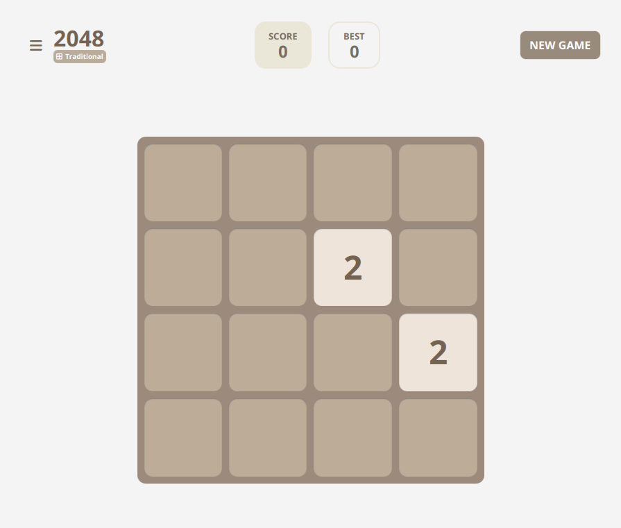
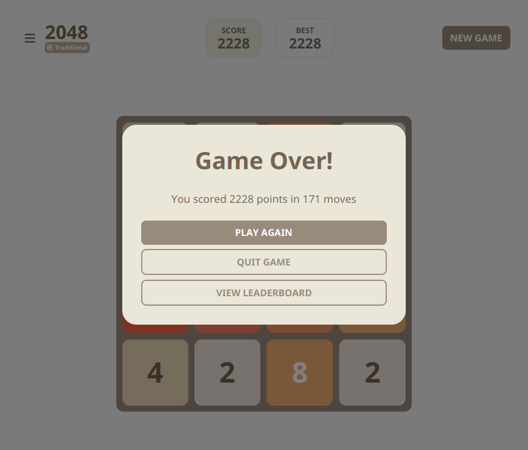
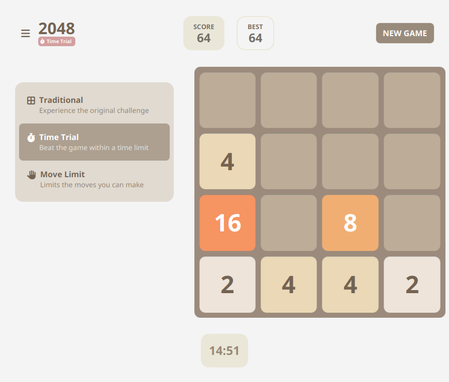

<p align="center">
  
</p>

<h1 align="center">
  2048FX
</h1>
<p align="center">
  A recreation of the famous game <a href="https://play2048.co/">2048</a> by Gabriele Cirulli in JavaFX.
</p>

<div align="center">



</div>

## What is 2048FX?

2048FX is a JavaFX implementation of the game 2048.

2048 is popular single-player puzzle game created by Gabriele Cirulli. The game was released in March 2014 and quickly gained widespread popularity due to its simple yet addictive gameplay.

Although it is a web application, we (a group of students at the time of creating this) wanted to recreate the game as a desktop application using JavaFX while being faithful to the original design and mechanics.

## OS Compatibility

Due to the implementation of this being in Java, 2048FX is compatible on all operating systems that support Java: **Windows, Linux, MacOS**.

## Getting Started

### Prerequisites

- [JDK 21](https://www.oracle.com/java/technologies/javase-jdk21-downloads.html) (or higher)

### Installation

To install this project, first clone it from GitHub:

```sh
git clone https://github.com/jwmarb/2048-javafx
```

### Running the application

Once you have cloned the repository, navigate to the root directory of the project and run the following command in your terminal:

```sh
chmod +x ./gradlew && ./gradlew run
```

After that, the desktop application should appear on your screen.

## How to Play

The controls are simple. You can use W, A, S, D or the arrow keys to move the tiles.

- **W** / Up Arrow: Move all tiles upwards.
- **A** / Left Arrow: Move all tiles to the left.
- **S** / Down Arrow: Move all tiles downwards.
- **D** / Right Arrow: Move all tiles to the right.

Your goal is to combine the numbers on the tiles until you reach 2048. Each time two identical numbers collide, they merge into a tile with the value equal to their sum. The game ends when no more moves are possible.

# Contributing

See [CONTRIBUTING](/CONTRIBUTING.md).
